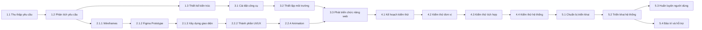

# Network Diagram

```mermaid
flowchart LR
  A[1.1 Thu thập yêu cầu] --> B[1.2 Phân tích yêu cầu]
  B --> C[1.3 Thiết kế kiến trúc]
  B --> D[2.1.1 Wireframes]
  D --> E[2.1.2 Figma Prototype]
  E --> F[2.1.3 Xây dựng giao diện]
  F --> G[2.2.2 Thành phần UI/UX]
  G --> H[2.2.4 Animation]
  C --> I[3.1 Cài đặt công cụ]
  I --> J[3.2 Thiết lập môi trường]
  J --> K[3.3 Phát triển chức năng web]
  H --> K
  K --> L[4.1 Kế hoạch kiểm thử]
  L --> M[4.2 Kiểm thử đơn vị]
  M --> N[4.3 Kiểm thử tích hợp]
  N --> O[4.4 Kiểm thử hệ thống]
  O --> P[5.1 Chuẩn bị triển khai]
  P --> Q[5.2 Triển khai hệ thống]
  Q --> R[5.3 Huấn luyện người dùng]
  Q --> S[5.4 Bảo trì và hỗ trợ]
```
